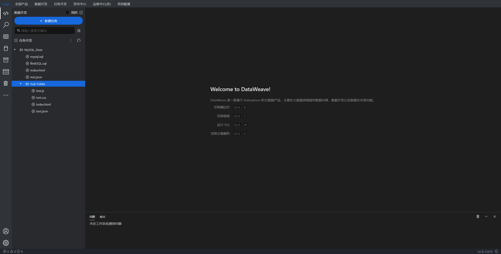

# 文档

## 简介

基于 Web IDE UI 框架 [Molecule](https://github.com/DTStack/molecule) 开发 Web SQL Editor。

> 效果图

## Feature List

### 布局

参考 Vscode 布局方式进行页面布局。（包含如下六个板块）（完成度 90%）

- [x] MenuBar（菜单栏，位于顶部）
- [x] ActivityBar（活动栏，位于最左侧）
- [x] SiderBar（边栏，紧贴于 ActivityBar 右侧）
- [x] Editor（编辑区，位于中部）
- [x] Panel（面板如终端、输出、问题面板等，位于底部）
- [x] StatusBar（活动栏，位于最底部）

### 编辑器功能

期望支持大数据领域各种 SQL 方言的代码编辑、代码高亮、智能提示、上下文补全（库表补全）等功能。（即将开发）

> 参考 [dt-sql-parser](https://github.com/DTStack/dt-sql-parser)

- [ ] MySQL
- [ ] FlinkSQL
- [ ] SparkSQL
- [ ] HiveSQL
- [ ] TrinoSQL (PrestoSQL)
- [ ] PostgreSQL
- [ ] PL/SQL

### 待完善功能（完成度 50%）

> 添加了一些主题和快捷键，但作为一个产品还有些距离。

- 主题（自定义默认 One Dark Pro）
- 快捷键
- [ ] 设置
- 图标样式

### 待确定

待确定或后端未实现功能：

- [ ] All_API_DATA（所有接口数据）
- [ ] 产品菜单所有功能
- [ ] 登录（鉴权）
- [ ] 新建任务
- [ ] 运行、保存等等
- [ ] 数据库设计

## 安装指南

### 安装依赖

- 命令 `yarn`

### 启动项目

- 命令 `yarn start`

- 应用程序访问地址：`http://localhost:3000`
- 接口 Mock 数据（文件树）访问地址：`http://localhost:3002/data`

## 技术栈

### 布局方案

- dtinsight/molecule 1.3.0

### UI

- react 18.2.0
- antd 5.11.1

### 样式方案

- emotion 11.11.0

### Icon 图标

- [vscode 原生](https://microsoft.github.io/vscode-codicons/dist/codicon.html)
- @ant-design/icons 5.2.6

### 网络请求

- react-query 3.93.3

### 状态管理

- localStorage 本地存储
- zustand 4.4.7

### 工具库

- ahook 3.7.8
- lodash 4.17.21
- qs 6.11.2
